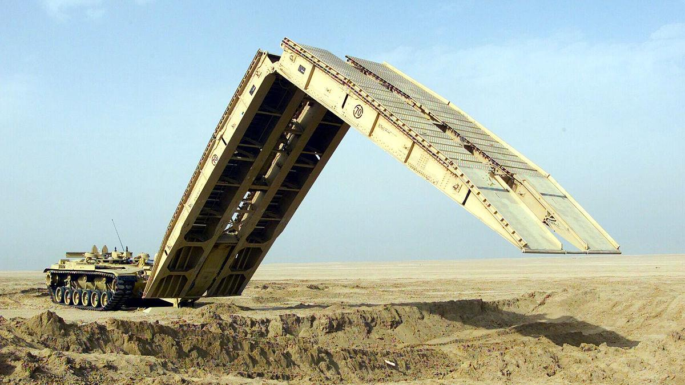

# Military Bridge-Deployment Vehicle
## A robust military vehicle that can deploy portable bridges across difficult landscapes for smooth traffic movement.

#### This was a team project and was a part of [Analysis and Design of Machine Components](https://mech.nitk.ac.in/course/analysis-and-design-machine-components) course.

Such vehicles do exist in the form of tanks.

###### Here is a demo of the prototype we built

##### Analysis of the components used in this prototype can be found [here](static/presentation.pdf)
